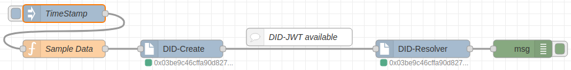

# node-red-contrib-decentralized-identity

<a href="https://stromdao.de/" target="_blank" title="STROMDAO - Digital Energy Infrastructure"></a>

**Node-RED - DID-JWT nodes allowing to sign msg.payload and verify JSON Web Tokens (JWT) for use of payload in flow.**

[](https://www.npmjs.com/package/node-red-contrib-decentralized-identity)
[](https://www.npmjs.com/package/node-red-contrib-decentralized-identity)
[](https://co2offset.io/badge.html?host=node-red-contrib-decentralized-identity)

Based on [DID-JWT](https://github.com/decentralized-identity/did-jwt) and [EthrDID](https://github.com/uport-project/ethr-did/).

## Configuration

Install using Node-RED Package Manager (Palett)

### Usage

#### Sample Flow



[Flow](./sample_flow.json)


#### Create JWT
If a new `msg.paylaod` is received a DID in JWT format will be returned as `msg.payload`. Ensure typeof `msg.payload` is an JSON-Object.

#### Validate/Resolve from JWT
If a new `msg.payload` is received with a JWT it gets validated. On success `msg.payload` contains orignal payload (from creation) and `msg.issuer` the publicKey (Identifier) of the origin.

### For Production

Ensure flow data gets persisted as the creation will otherwise create a new signing key on each request which makes it useless to validate the signer of a message.

Hint: .node-red/settings.json
```javascript
contextStorage: {
        default: {
            module:"localfilesystem"
        },
    },
```

## Maintainer / Imprint

<addr>
STROMDAO GmbH  <br/>
Gerhard Weiser Ring 29  <br/>
69256 Mauer  <br/>
Germany  <br/>
  <br/>
+49 6226 968 009 0  <br/>
  <br/>
kontakt@stromdao.com  <br/>
  <br/>
Handelsregister: HRB 728691 (Amtsgericht Mannheim)
</addr>

Project Website: https://co2offset.io/

## LICENSE
[Apache-2.0](./LICENSE)
